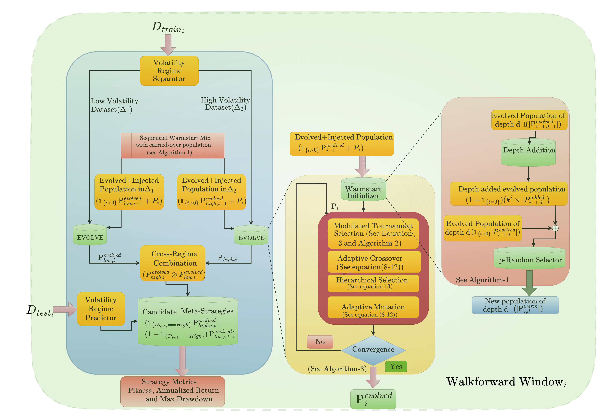
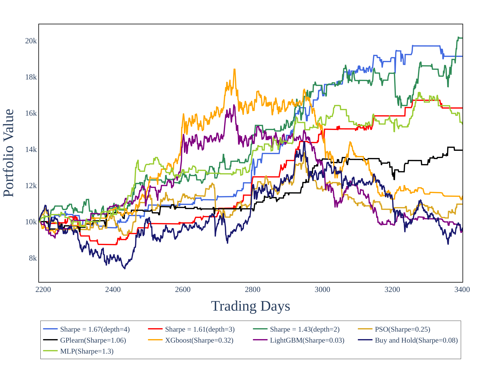

# MAGA:  Multihead Adaptive Genetic Algorithm 
*A framework for trading signal discovery and strategy evolution based on volatility-regime awareness*

  
  

---

## Overview  
This repository is the implementation of **MAGA framework** — a genetic-programming system designed to evolve trading strategies that adapt to differing volatility regimes. It is tailored for quantitative investing, focusing on the CSI300, SPY500 and Currency Pairs.  
It leverages a two-stage process: first identifying volatility regimes using a GARCH-based classifier; then evolving signal trees separately for high-vol and low-vol regimes; finally back-testing strategy portfolios on out-of-sample data.
It integrates 3 components:
- a consecutive warm-start scheduler
- an Adam-based rate controller that applies momentum-driven updates to crossover and mutation probabilities
- a dynamic fitness sharing scheme that preserves diversity as a precondition for effective scheduling. 

  

  Figure 1: MAGA-Fin pipeline: volatility classification → regime-specific evolution → strategy deployment.  

---

## Key Features  
- Regime-aware signal evolution (high vol vs low vol)  
- Rolling GARCH forecasting for regime detection  
- Genetic programming of trading‐trees (mutation, crossover)  
- Out-of-sample back-testing of evolved strategies  
- Comprehensive structure: single notebook (`MAGA_Code.ipynb`) + modular data/logic

  

  Figure 2: Sample results on CSI300 from 2018-2023: evolved strategy performance (for different initialization depths) vs baseline.  

