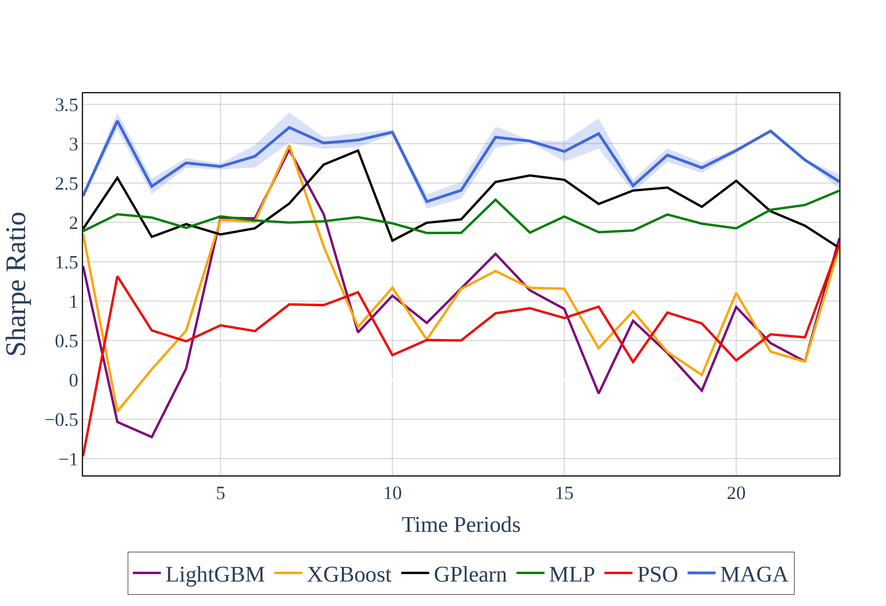
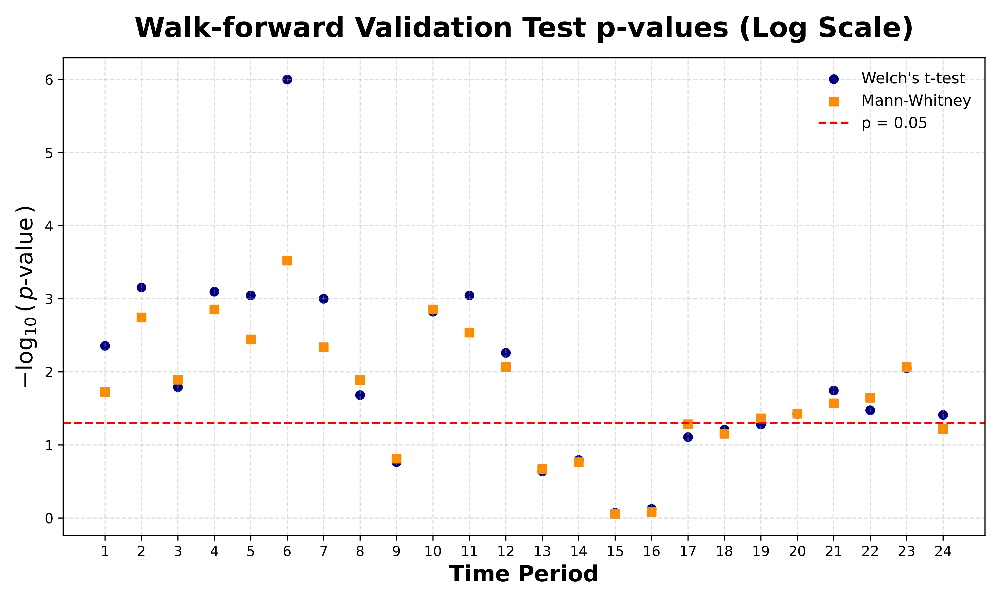

# MAGA: Multihead Adaptive Genetic Algorithm

### Adaptive Evolutionary Search in Non-Stationary Financial Environments

This repository contains the official implementation of:

> **MAGA: Multihead Adaptive Genetic Algorithm in Non-Stationary Environments**

---

## Abstract

Standard evolutionary computation (EC) frameworks assume a stationary fitness landscape and static parameter settings. This assumption is fundamentally violated in dynamic financial environments.

MAGA reconceptualizes evolutionary hyperparameters as **schedulable control variables**, inspired by deep learning learning-rate scheduling. The framework integrates:

1. **Consecutive Warmstart Scheduling** — controls population carry-over across walk-forward windows.
2. **Adam-based Operator Rate Control** — momentum-driven adaptive tuning of crossover and mutation probabilities.
3. **Dynamic Fitness Sharing** — generation-aware diversity preservation via behavior-based similarity penalties.
4. **Volatility Regime Separation** — statistical regime detection using GARCH-family models and Otsu thresholding.

The system is evaluated under a rigorous walk-forward protocol across equity indices and currency pairs, demonstrating improved out-of-sample robustness and up to two-fold Sharpe ratio improvement over baselines.

---

# Repository Structure

```
Alpha-Mining-GP/
│
├── VolatilityModelling/      # GARCH-based regime detection
│   ├── VolatilityClassifier.py
│   ├── YangZhenVol.py
│
├── StrategyTree/             # GP tree representation and operators
│   ├── TreeSignalCalc.py
│   ├── TreeStruct.py
│   ├── TreeUtils.py
│
├── BacktestFolder/           # Vectorized portfolio evaluation
│   ├── backtest.py
│
├── GA_Integration/           # Walk-forward orchestration
│   ├── kwargs_dataclass.py
│   ├── strategy_evolve.py
│
├── GeneticProgrammingArchitecture/  # GP utilities and modules
│   ├── GPUtils.py
│   ├── NextgenModule.py
│   ├── SimilarityScore.py
│
├── AblationCodes/            # Ablation study codes
│   ├── GPLearn_test.py
│   ├── LGB_XGB_test.py
│   ├── MLP_test.py
│   ├── PSO_test.py
│
├── Alpha101/                 # Alpha formula utilities
│   ├── formulaicalpha.py
│   ├── packages.py
│   ├── utils.py
│
├── DatasetsFolder/           # Dataset files
│   ├── TF1_indicators_spx.csv
│   ├── zscored_alpha101_indicators_csi300.csv
│   ├── zscored_alpha101_indicators_eur_aud.csv
│   ├── zscored_alpha101_indicators_eur_chf.csv
│   ├── zscored_alpha101_indicators_eur_usd.csv
│   ├── zscored_alpha101_indicators_usd_jpy.csv
│   ├── zscored_indicators_spy.csv
│
├── hyperparam.py             # Experiment configuration
├── main.py                   # Entry point
├── requirements.txt          # Dependencies
├── README.md                 # Project documentation
└── config.yaml               # Configuration file
```

---

# Methodological Overview

The pipeline operates in sequential walk-forward windows:

### 1️⃣ Volatility Regime Detection

* Conditional volatility estimated via GARCH-family models.
* Optimal model selected via RMSE against Yang–Zhang estimator.
* Regimes separated using Otsu’s thresholding.
* Test regime classification uses rolling forecasted volatility.
<p align="center">  </p> <p align="center"> <b>Figure 1.</b> MAGA pipeline: volatility classification → regime-specific evolution → cross-regime strategy deployment. </p>

### 2️⃣ Consecutive Warmstart

Each new window:

* Injects new individuals
* Retains previous evolved population
* Samples new population probabilistically

The expected survivor count follows:

```math
\mu_D = N \prod_{i=1}^D \frac{1}{1 + k_i}
```

with concentration bounds derived via Bernstein–Serfling inequality.

### 3️⃣ Dynamic Fitness Sharing

Fitness is modified as:

```math
f'_s(g) = \frac{f_s(g)}{(1 + n_s)e^{-g/G}}
```

Similarity is measured phenotypically using portfolio correlation.

### 4️⃣ Adam-based Operator Rate Adaptation

Rates updated via momentum:

```math
p_{t+1} = p_t + \eta \frac{\hat{m}_t}{\sqrt{\hat{v}_t} + \epsilon}
```

This enables stable adaptive exploration in derivative-free landscapes.

---

# Experimental Protocol

Evaluation uses:

* Walk-forward validation
* Strict out-of-sample testing
* Sharpe Ratio
* Maximum Drawdown
* Annualized Return

Benchmarks include:

* LightGBM
* XGBoost
* gplearn (baseline GP)
* PSO
* MLP

All models use the same base alpha pool for fairness.

---
### Experimental Results

Strategy Performance (CSI300 Example)
<p align="center">  </p> <p align="center"> <b>Figure 2.</b> Out-of-sample portfolio performance on CSI300 (2018–2023). MAGA meta-strategies across initialization depths vs benchmark baselines. </p>
Walk-Forward Robustness Across Windows
<p align="center">  </p> <p align="center"> <b>Figure 3.</b> Comparative Sharpe ratio performance across consecutive walk-forward windows on S&P500. MAGA consistently outperforms static and non-evolutionary baselines. </p>
Statistical Significance of Fitness Suppression
<p align="center">  </p> <p align="center"> <b>Figure 5.</b> Log-scale p-values from Welch’s t-test and Mann-Whitney U test comparing modified fitness vs raw fitness across validation windows. The scheduled fitness suppression mechanism yields statistically significant improvements in the majority of periods. </p>

# Installation

### 1️⃣ Clone repository

```bash
git clone https://github.com/JovialWanderer/Alpha-Mining-GP.git
cd Alpha-Mining-GP
```

### 2️⃣ Create virtual environment

```bash
python -m venv venv
source venv/bin/activate  # macOS/Linux
venv\Scripts\activate     # Windows
```

### 3️⃣ Install dependencies

```bash
pip install -r requirements.txt
```

---

# Running Experiments

Modify hyperparameters in:

```
hyperparam.py
```

Run:

```bash
python main.py
```

Experiments are executed sequentially across walk-forward windows.

---

# Reproducibility Notes

* Random seeds are controlled in configuration.
* Data is sourced via:

  * Yahoo Finance
  * vectorbt
* All results in the paper correspond to fixed configurations reported in the manuscript.

This repository is research-oriented and prioritizes experimental clarity over production optimization.

---

# Computational Complexity

Per full run:

```math
O(W \cdot G \cdot L \cdot (N_p 2^{D_{max}} + N_p^2))
```

where:

* ( W ) = walk-forward windows
* ( G ) = generations per window
* ( L ) = training days
* ( N_p ) = population size

---

# Limitations

* Research prototype (not production trading infrastructure)
* Computationally intensive
* Backtests assume frictionless execution unless specified
* No live trading deployment support

---

# Citation

If you use this work, please cite:

```
@article{MAGA2025,
  title={MAGA: Multihead Adaptive Genetic Algorithm in Non-Stationary Environments},
  journal={IEEE Transactions on Evolutionary Computation},
  year={2025}
}
```

---

# Future Work

Planned extensions:

* Multi-objective EC (NSGA-II / MOEA-D)
* Portfolio-level joint optimization
* Risk-constrained fitness formulations
* Regime detection via state-space models

---


